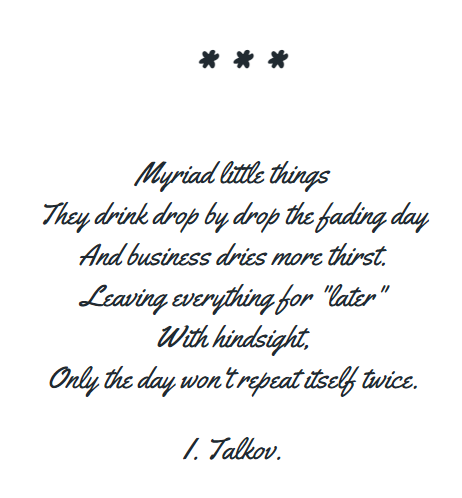
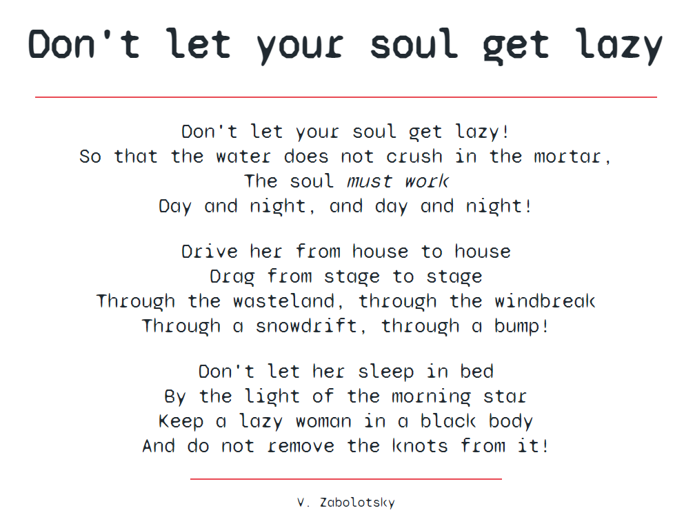

POEM
====

#### layout of poetry

In this repository you can see examples of typesetting of poems by famous poets. 
These tasks were performed to train working with texts.

Example one:

Example two:

