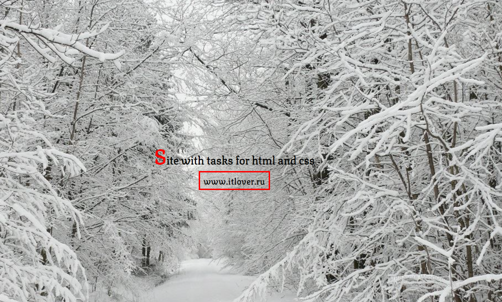

In this repository you can find a solution to the problem STRING AND LETTERS.

the essence of the task is to create a foreign site with a name and a link in the center.
Solution prototype:

and also when hovering over the link:

